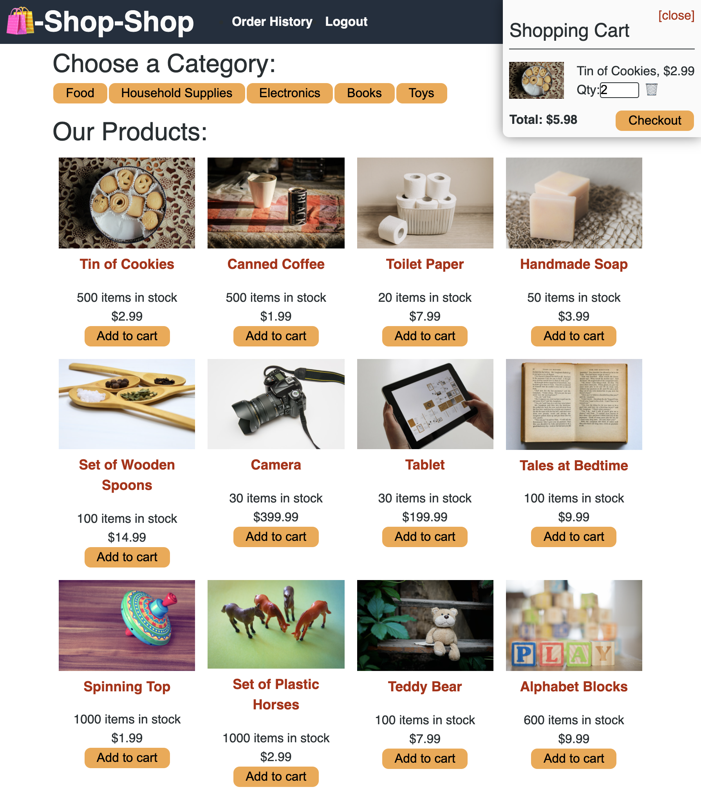

# Shop Redux

## Description

The perfect application to shop to your hearts content!

## Table of Contents

- [Installation](#installation)
- [Usage](#usage)
- [License](#license)
- [Contributing](#contributing)
- [Questions](#questions)

## Installation

Clone this repo using the git clone command! Once cloned, download the necessary dependencies listed in the package.json file. In your server and client directory, start both your local hosts with "npm start."

## Usage

Visit https://damp-chamber-17891.herokuapp.com/ for the deployed app.

The Home Menu

## License

## Contributing

EricaBabb

## Questions

Github: EricaBabb
Email: ecamilebabb@gmail.com

